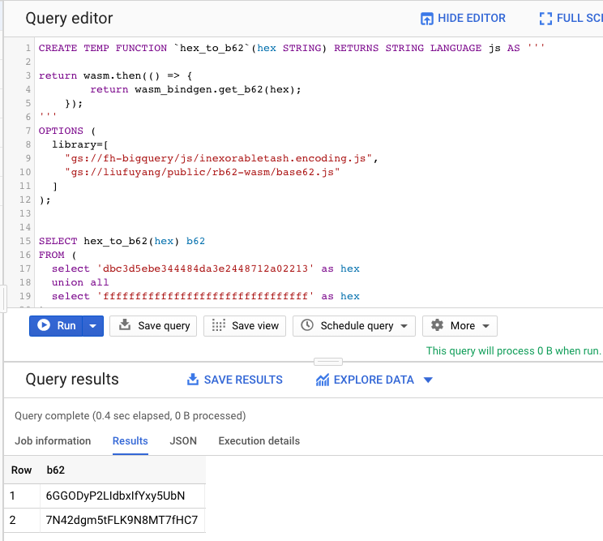

This is a demo project that you can easily run Rust code as wasm on browser or Bigquery, 
relatively easily.

To build the project:
```
wasm-pack build --release --target no-modules
node generate.js 
# above commend will generate a base62.js file
```

And you need to manually replace the word `self` to `this` in `base62.js`.
(For now this is now I get it to work, not sure in the future there will be some 
changes on the generated code.)

Then you can upload the `base62.js` file to BigQuery. Then you can test out some queries
like `try1.sql`.

Or you can visit this simple page https://liufuyang.github.io/rb62-wasm/ to try run the wasm in browser.

Note:
* It seems for now to let the JS script work on Bigquery you would need 
this `"gs://fh-bigquery/js/inexorabletash.encoding.js"` package. As mentioned here
https://stackoverflow.com/questions/60094731/can-i-use-textencoder-in-bigquery-js-udf/60102710#60102710

<h4>And this is what it looks like if you upload base62.js and use it in BigQuery as a user defined function</h4>
<div>
    
</div>
